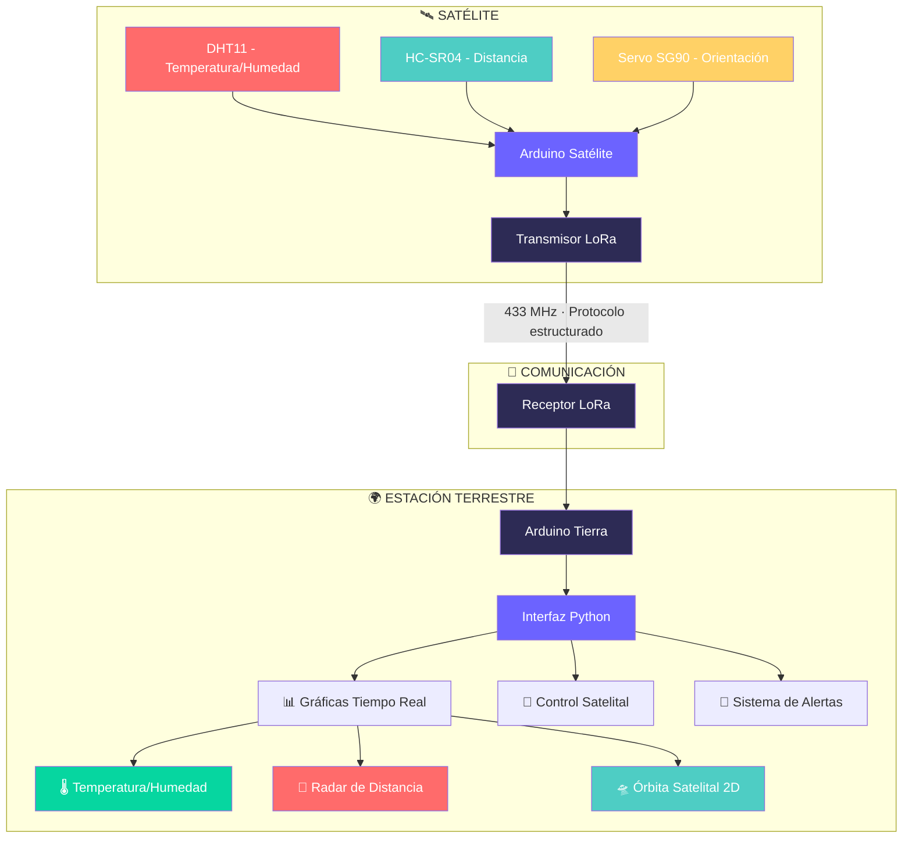

# 🛰️ PROYECTO DE COMUNICACIÓN SATÉLITE-TIERRA  Grup 15 🛰️

## INTEGRANTES DEL EQUIPO
ASIER                             LUCIA                                MIGUEL

## DESCRIPCIÓN DEL PROYECTO

El proyecto consiste en un sistema de comunicación bidireccional entre un satélite simulado y una estación terrestre, implementado con dos módulos Arduino. El satélite captura datos mediante sensores y los transmite a la estación terrestre, donde una interfaz gráfica en Python visualiza la información en tiempo real.

**CARACTERÍSTICAS PRINCIPALES**

  
- Sistema satélite-tierra con comunicación LoRa
  - Tecnología LoRa SX1276 a 433 MHz 
- Sensores integrados en satélite
  - DHT11(sensor) para temperatura y humedad
  - HC-SR04(sensor ultrasonidos) para medición de distancia
  - Servo SG90 para orientación tipo radar
- Interfaz gráfica en tiempo real
  - Desarrollada en Python con Tkinter
  - Visualización de las graficas 
- Protocolo de comunicación estructurado
  - Múltiples tipos de mensaje (temperatura, humedad, distancia)
  - Sistema de control bidireccional
- Sistema de alarmas y validación
  - Alarmas visuales y auditivas (LEDs y buzzer)
  

**Estructura del Proyecto**

## VERSIONES

**VERSIÓN 1:**

Durante esta versión 1 no hemos conseguido cumplir con todos los pasos indicados. Hemos logrado hacer hasta el paso 3, es decir; hemos hecho que envíe los datos de temperatura, los reciba el otro ordenador, y los muestre en una gráfica que está incrustada en una interfaz. Pensamos que no hemos podido acabar todos los puntos de la versión 1 ya que ninguno de los tres prácticamente había usado nunca el Arduino y en las primeras clases tuvimos dificultades. Sin embargo, a medida que hemos ido practicando las cosas nos han empezado a salir mejor. Por último, pensamos que hemos trabajado bastante bien pero nos ha faltado más comunicación y más coordinación entre nosotros. Esperamos hacerlo mejor en las próximas versiones.

VIDEO V1:
https://drive.google.com/file/d/1L8MmuHGUYzk3Fw5PDx3Sk3lThohy9duL/view?usp=drive_link

**VERSIÓN 2:**

En este tiempo hemos terminado lo que nos faltaba por acabar de la versión 1 y hemos comenzado la versión 2, aunque todavía nos faltan bastantes cosas y los códigos no funcionan con todo junto. Por eso, en el video solo sale la versión 1 y el código del test unitario que tenemos de la versión 2 y que sí funciona. Hemos tenido algunas dificultades al unir estos códigos, y por eso, como no está del todo bien, no hay video. Nos aseguraremos de que para la versión 3 esté todo hecho.

VIDEO V2:

https://drive.google.com/file/d/17cMnbxN7gR1Ks_FBl84Vf93BH628MKZ-/view?usp=sharing

**VERSIÓN 3:**

Tenemos todo lo que se pide menos la gráfica de las órbitas, ya que no acaba de salir bien en la interfaz. También, como decimos en el video, nos falta arreglar pequeñas cosas de la interfaz y de la alarma.

  
VIDEO V3:

https://drive.google.com/file/d/1Vp3Mgnz5NVvSKLzOE6YZtBhTxNeMwWKn/view?usp=sharing

**VERSIÓN 4:**

Proyecto Finalizado. En esta última versión hemos completado con éxito el sistema integral. Todo funciona correctamente: la comunicación bidireccional satélite-tierra, la captura de datos de todos los sensores, el procesamiento y la visualización en tiempo real.

La principal mejora ha sido una interfaz gráfica completamente rediseñada y optimizada. Es más intuitiva, visual y cuenta con múltiples opciones y controles, incluyendo la incorporación del cálculo de medias de humedad y un sistema de alertas depurado.

VIDEO V4:

https://youtu.be/eCw8Vex8Cco

__________________________________________________________________________________________________________________________________________________________________________

